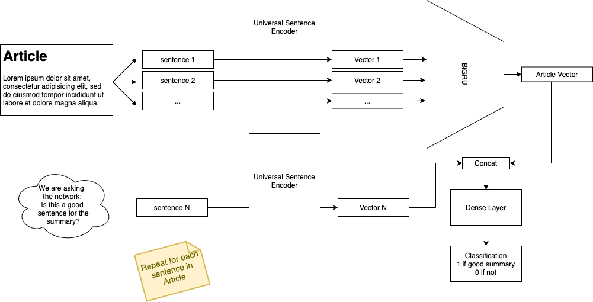
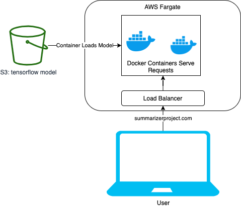

# Summarizer

Joe Zeimen

Capstone project for the Springboard Machine Learning Engineering program. 

## Problem Statement

Text summarization can be used for many purposes. It obviously would help a reader get the gist of an article faster, and save time. Say the user wanted to figure out which document of a list of documents they would like to read. They could get the summary for each one so they waste less time reading articles they do not care about. In a business setting documents or emails coming in could be summarized to help the user sort through them. 

This project focuses on summarizing news articles. 

This project does a little bit of everything from processing the data, building a model and serving it in a docker container in AWS. 

## Problem Simplification

This project takes the extractive summarization approach by trying to figure out which sentences would best summarize the article. This is opposed to abstractive summarization where new sentences are written in an attempt to summarize the article. 

So the main idea here is that I take the article and split it into sentences, then turn that into a classification problem. For each sentence trying to predict 1 if it should be in the summary and 0 if not. See the "Data" section below for how labeled data is generated for training.

Another goal for this project was to gain experience in Tensorflow and deep learning so I focused on attempting to do that.


## Data
This project uses data from the ["cnn_dailymail" dataset from Tensorflow Dataset](https://www.tensorflow.org/datasets/catalog/cnn_dailymail) which was originally made for *[Get To The Point: Summarization with Pointer-Generator Networks](https://arxiv.org/abs/1704.04368)*

This dataset has over 300,000 articles from CNN and Daily Mail and an extracted summary from "highlights" of the article. The dataset already has split out train, test and validation splits so I used that. See the link above for all the metadata and how to download.

For this problem I end up labeling each sentence in each article whether it should be included in the summary or not. One parameter for this is how many sentences should be in the final summary (`N_SUMMARY_SENTENCES`). To do this I used a greedy algorithm that adds the next best sentence optimizing the Rouge score until `N_SUMMARY_SENTENCES` are in the summary or no other sentence improves the score. 

The sentences that produced a 

The idea for processing it like this comes from this paper:

_SummaRuNNer: A Recurrent Neural Network based Sequence Model for Extractive Summarization of Documents._
Ramesh Nallapati, Feifei Zhai, Bowen Zhou 
https://arxiv.org/pdf/1611.04230.pdf

To split the sentences I tried 3 different sentence tokenizers, but Spacy seemed to be the best in terms of ease of use and eyeballing some examples. 


More detailed implementation and the code to download and process this can be found in the [LabelDataPy notebook.](data/LabelDataPy.ipynb)


## Training

The model is trained in TensorFlow. I think it is easiest to start with a diagram. 


The network works like this. 

First the article is split into sentences. Then the first 30 sentences are fed through Universal Sentence Encoder. This is to produce a semantic meaning of the sentences leveraging transfer learning. These vectors are then passed through a BiGRU to produce 1 vector representing the entire article. 

Meanwhile one sentence from the article is passed through Universal Sentence Encoder to get a vector. 

The two vectors are concatenated and are fed through a dense NN to get to a final decision on whether or not this article is a good summary. The loss function is binary cross entropy. 

The output of course is never exactly 0 or 1, so this can be treated as a score. To do the prediction for the best summary the top N scoring sentences can be used. 


## Results
To have something to compare against I compare the top N scoring sentences against the first N sentences in the article. I use the ROUGE F1 score to do this. 

* mean model_rouge: 0.284209 (What the model chose)
* mean naive_rouge: 0.267632 (The first sentence)
* mean best_possible: 0.434478 (Best you could do knowing what the summary is)

The state of the art models get closer to .38 and above for this measure. You can see more papers and implementations at [NLP Progress: Summarization.](http://nlpprogress.com/english/summarization.html)

The model could be improved in this system. I think one of the most important things to do would be to swap out the BiGRU with a transformer and find some way to for the model to consider all of the sentences in an at once so that it has context of what it has already added. Right now the model may be trying to add sentences that already are much like the other sentences in the summary not adding much value. 

[Checkout the training notebook for more information](data/Train.ipynb)


## Model Serving Web App

To serve the model there is a simple flask application with a simple form to paste in a news article. Upon submission the flask application takes the article, splits it into sentences and feeds it through the saved TensorFlow model from the training step. 

The model file lives in S3 so that if a new version of the model file needs to be deployed it can be done with no downtime. Upon container startup it will look at the `S3_BUCKET` and `MODEL_OBJECT` environment variables. This means you can start a new docker container with different environment variables and once it is ready turn off the old container that pointed to a different model. There is also a hard coded reference to the first model of this project incase this is not set. 

### Run the serving app locally
Assuming you have docker installed all you need to do is run this from the `serve` directory. This will build and run the docker container. Upon startup this will download a 2GB file so it will take a while to startup. It will also print lots of messages while TensorFlow is loading the model. 

```
docker build -t summarizer . && docker run -it --rm  -p 5000:80 summarizer
```

## Deployment

At the time of this writing the application is running on AWS at [summarizerproject.com](http://summarizerproject.com)

To deploy this application I decided on using AWS Fargate to run docker container(s). This approach allows for very inexpensive run costs when developing and also shows how you could easily scale it to many users by backing a load balancer with more containers. 



Here are the steps I used to deploy the application.

1. Create ECR repository `aws ecr create-repository --repository-name summarizer`
2. Login to docker repository `aws ecr get-login-password --region us-west-2 | docker login --username AWS --password-stdin <AWS ACCOUNT ID>.dkr.ecr.us-west-2.amazonaws.com`
3. Build image locally `docker build -t summarizer`
4. Tag it `docker tag summarizer:latest <AWS ACCOUNT ID>.dkr.ecr.us-west-2.amazonaws.com/summarizer`
5. Push the image `docker push <AWS ACCOUNT ID>.dkr.ecr.us-west-2.amazonaws.com/summarizer`
6. Login to the AWS console
7. Go to [ECS](https://us-west-2.console.aws.amazon.com/ecs/home)
8. Click the "Get Started Button" under "Clusters"
9. Under "Cluster Definition" configure "Custom"
10. Put "summarizer" in the name field
11. Put the image in the "Image" field `<AWS ACCOUNT ID>.dkr.ecr.us-west-2.amazonaws.com/summarizer`
12. put 80 in the port mapping (so load balancer can be used)
13. Optional: set environment variables to point to another s3 bucket/object if needed. 
14. Click "Update"
15. Edit the task definition to give it more ram I used 5GB and 1 vCPU
16. Click next and on the next page select to use a application load balancer.
17. Click next and set a cluster name. 
18. Review and click "create".
19. Wait about 5 minutes and everything will be started. 


Now you can click the link to view the load balancer and get the DNS name. Paste that into your browser and you can view the web app!
If you get a 503 give it a few more minutes to startup the container. 

At this point this is all costing money (See the next section). To make sure it is no longer doing things that cost money go through this list. 

- Turn off the cluster by 
    - going to ECS
    - Click on the cluster you just made
    - Click "Delete Cluster" and finish the prompts. 
- Delete the ECR repo
- Delete any buckets you made in S3

## Monitoring
You can view the logs for any of the containers by going to the task in the console. Here you can see every request being logged. This is also where you would start to debug any issues. 

AWS will also monitor the task with a health check. If the health check stops working it will restart the task. 

## Scale

To scale up the app instead of choosing 1 container you can set it up to do as many as needed. Since this doesn't rely on other services there is nothing else to scale. 

To so this simply go back to your cluster, check the box next to the one service. Update it and add more tasks. this will in turn create more containers it will also cost more money. 


### Cost
The costs for ECS generally are most impacted by the amount of CPU and memory. The costs for the other services is pretty negligible.  

Memory: $0.004445 per GB per hour
vCPU: 0.04048 per hour
So in 24 hours the costs are about $1.61 per day for the container.

S3 is $0.023 per gigabyte per month. So only a few cents when it is only 2 GB. 

Domain $12 per year through AWS. 


# Testing

To run the tests for the web app. 1st download the [model file](https://drive.google.com/file/d/1KwCcKxTNmvAVGYGt3Yrd-Kk5VscN4hRG/view?usp=sharing). 

Then make a directory called model in summarizer called `model`. Move the file that was just downloaded here and extract it. 

Then from the serve directory run `python -B -m unittest test/*`

